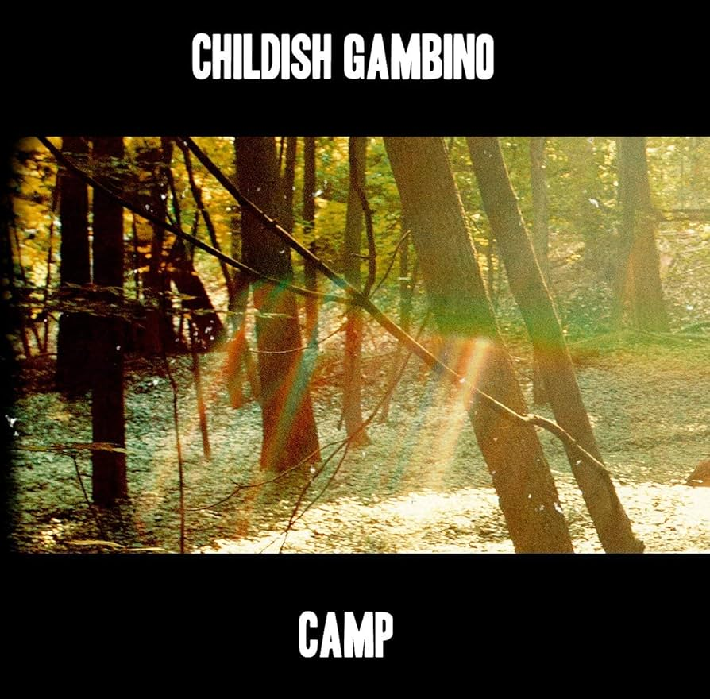
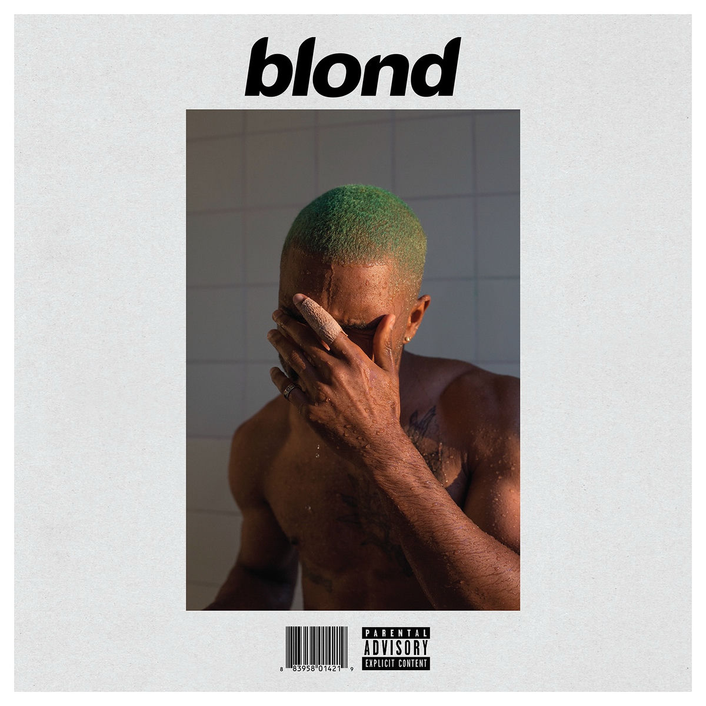

.page-title {
  display: none;
}

[Accueil](index.md) | [Chill](chill.md) | [Dynamique](dynamique.md) | [Festif](festive.md)

# 🌙 Chill

Imagine-toi un après-midi tranquille, allongé·e sur ton canapé ou installé·e près de la fenêtre, un café ou un thé à la main.  
Le temps semble s’étirer, dehors le monde continue sa course mais à l’intérieur tout est calme.  
C’est le moment parfait pour se laisser porter par des sons doux, introspectifs, qui invitent à ralentir et à savourer l’instant.

## Hit Me Hard and Soft – Billie Eilish

Cet album explore une palette de sons très contrastée, allant de morceaux intimistes et minimalistes à des passages plus puissants et émotionnellement chargés.  
Les thèmes principaux tournent autour de l’introspection, des relations complexes et de l’expression des émotions brutes.  

Ce qui me plaît particulièrement chez Billie, c’est **la douceur de sa voix**, capable de transmettre une grande fragilité, et en même temps **l’intensité de la musique**, qui peut passer d’un murmure à une explosion émotionnelle en un instant. Cette combinaison rend l’écoute à la fois apaisante et captivante.  

**À écouter en priorité** :  
- **Birds of a Feather** → doux, aérien, parfait pour se laisser emporter par la voix et l’atmosphère  
- **Wildflower** → plus intense, avec des passages émotionnels puissants qui contrastent avec la délicatesse de sa voix

[Écouter sur Spotify ➡️](https://open.spotify.com/intl-fr/album/7aJuG4TFXa2hmE4z1yxc3n)

---

## Magazine – Dali

*Magazine* est un album aux textures riches et planantes, mélangeant influences électroniques et expérimentales.  
L’ambiance générale est flottante et hypnotique, avec des couches sonores qui se superposent pour créer un univers immersif.  
Les thèmes tournent autour de l’évasion, de l’imaginaire et de la rêverie, avec un sentiment constant de mouvement et de liberté intérieure.  

Ce que j’aime dans cet album, c’est la façon dont chaque morceau semble raconter une histoire sans paroles parfois, ou transporter dans un monde presque cinématographique, où chaque son trouve sa place dans l’espace.  

**À écouter en priorité** :  
- **Obsession Nonchalante** → atmosphère planante et captivante, idéale pour se laisser flotter  
- **Mes Rêves** → mélodies douces et textures hypnotiques, parfaites pour rêver un peu

[Écouter sur Spotify ➡️](https://open.spotify.com/intl-fr/album/2yRG15GdCZMQte1m6ug5t1) 

---

## SOS – SZA

*SOS* est un album de R&B moderne et intimiste, où la voix de SZA est au centre et enveloppe chaque morceau.  
L’album explore l’amour, la vulnérabilité, le doute et la quête de soi, avec une honnêteté brute et touchante.  
La production reste légère et aérienne, permettant à la voix de se déployer pleinement et créant une intimité qui rapproche l’auditeur.  
Chaque morceau navigue entre douceur et tension, introspection et passages plus rythmés, formant un ensemble cohérent et immersif.

Ce que j’aime dans cet album, c’est la capacité de SZA à transmettre des émotions complexes avec une fluidité incroyable : on ressent à la fois la fragilité, la force et la sensibilité de chaque morceau.

**Mes morceaux préférés :**  
- **Snooze** → murmure confiant et délicat, qui enveloppe tout en douceur  
- **Kill Bill** → intensité et tension maîtrisées, avec une voix qui porte à la fois colère et vulnérabilité

[Écouter sur Spotify ➡️](https://open.spotify.com/intl-fr/album/07w0rG5TETcyihsEIZR3qG)

---

## Camp – Childish Gambino

*Camp* est un album à la croisée du hip-hop, du R&B et de la soul, qui mélange énergie et introspection.  
Les morceaux alternent entre passages rythmés et moments plus calmes, avec des textes souvent narratifs, parfois humoristiques, parfois sérieux.  
L’album explore des thèmes liés à la construction de soi, aux relations et aux observations sur le monde qui l’entoure, tout en gardant une légèreté qui le rend accessible et captivant.  
La production est variée mais cohérente, et l’ensemble dégage une sensation de spontanéité et de créativité maîtrisée.

Ce que j’aime particulièrement dans *Camp*, c’est la capacité de Childish Gambino à créer un univers à la fois personnel et universel, où chaque morceau raconte quelque chose, tout en gardant un côté ludique et surprenant.

**Mon morceau préféré :**  
- **Les** → un mélange de groove et de réflexion, où la voix et les rythmes s’entrelacent parfaitement, donnant à ce titre une énergie à la fois douce et captivante

[Écouter sur Spotify ➡️](https://open.spotify.com/intl-fr/album/5PtkofxPlrw8z3Sy2fj0V3)

---

## Cigarettes After Sex – Cigarettes After Sex

L’album éponyme de *Cigarettes After Sex* est un voyage doux et planant, où chaque morceau semble envelopper l’auditeur dans une atmosphère de rêve nocturne.  
Les sons sont minimalistes et vaporeux, avec des guitares délicates et une production intimiste qui met la voix fragile au premier plan.  
Les thèmes principaux tournent autour de l’amour, de la nostalgie et des émotions mélancoliques, avec cette capacité unique à capturer des moments intimes et suspendus dans le temps.  
L’ambiance générale est lente et contemplative, parfaite pour les instants où l’on veut se laisser flotter ou réfléchir tranquillement.

Ce que j’aime dans cet album, c’est la façon dont chaque morceau semble raconter une histoire personnelle mais universelle, avec une voix qui devient presque un instrument supplémentaire, douce et hypnotique.

**Mes morceaux préférés :**  
- **K.** → atmosphère délicate et rêveuse, qui enveloppe tout en subtilité  
- **Sweet** → mélodie flottante et mélancolique, un vrai cocon sonore

[Écouter sur Spotify ➡️](https://open.spotify.com/intl-fr/album/5chTLnnxlxQVAgEv6YbEBe)

---

## Blonde – Frank Ocean

*Blonde* est un album introspectif et aérien, où chaque morceau semble flotter dans un espace émotionnel vaste et délicat.  
L’album explore des thèmes comme l’amour, la solitude, la mémoire et la construction de soi, souvent à travers des récits fragmentés et poétiques.  
La production est subtile et minimaliste, laissant respirer les voix et les émotions, ce qui rend l’écoute à la fois intime et profondément immersive.  
Chaque chanson semble créer une atmosphère unique, et l’ensemble forme un voyage cohérent dans la sensibilité et la mélancolie de Frank Ocean.

Ce que j’aime dans *Blonde*, c’est cette capacité à mélanger fragilité et élégance, à raconter des histoires qui résonnent longtemps après l’écoute, avec des arrangements qui donnent envie de se perdre dans chaque détail.

**Mes morceaux préférés :**  
- **Ivy** → une mélodie poignante, douce et nostalgique, qui capture parfaitement l’introspection de l’album  
- **Pink + White** → aérien et lumineux, avec des harmonies qui flottent et apportent une chaleur subtile  
- **White Ferrari** → minimaliste et contemplatif, une vraie immersion dans l’intimité de l’album

[Écouter sur Spotify ➡️](https://open.spotify.com/intl-fr/album/3mH6qwIy9crq0I9YQbOuDf)

[⬅ Retour à l’accueil](index.md)
