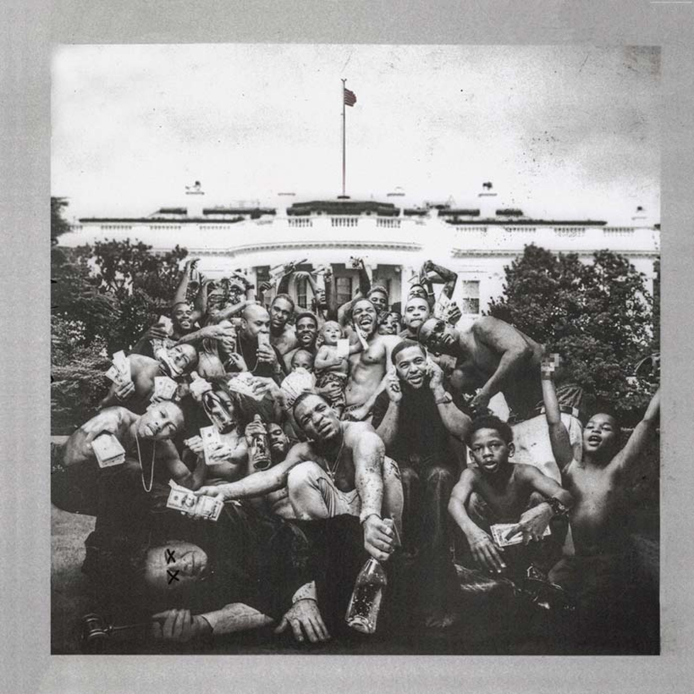

[Accueil](index.md) | [Chill](chill.md) | [Dynamique](dynamique.md) | [Festif](festive.md)

# Dynamique ⚡

Ici, on change de rythme. On quitte le flottement tranquille pour quelque chose de plus vivant, plus percutant. La vibe dynamique, c’est celle qui te donne envie de bouger, de t’activer, ou simplement d’allumer la musique un peu plus fort pour te laisser emporter.

Pas besoin d’être sur un dancefloor pour la ressentir — ça peut être en marchant vite dans la rue, en bossant avec concentration, ou juste quand tu veux une bande-son qui te pousse vers l’avant. Ces albums ont en commun une énergie qui accroche, des sons qui s’impriment, et une intensité qui garde éveillé.

## DeBÍ TiRAR MáS FOToS – Bad Bunny

Avec *Debí Tirar Más Fotos*, Bad Bunny explore un versant plus personnel et réfléchi de son univers. L’album mêle ses racines porto-ricaines à des sonorités urbaines et modernes, entre reggaeton, house, salsa et touches électroniques. L’ambiance générale est teintée de nostalgie et de mélancolie, comme un retour aux sources, mais sans jamais perdre l’énergie qui le définit.  

Ce qui me marque ici, c’est cette dualité constante : d’un côté des titres explosifs et entraînants, de l’autre des morceaux plus intimes, qui donnent presque l’impression de feuilleter un album souvenir. Le projet sonne comme un hommage à la mémoire, à l’importance de capturer les moments avant qu’ils s’effacent.  

**À écouter en priorité** :  
- **Nuevayol** → puissant et énergique, un concentré de vibe urbaine  
- **La Mudanza** → plus introspectif, empreint de nostalgie et de douceur  

(https://open.spotify.com/intl-fr/album/5K79FLRUCSysQnVESLcTdb)
---

## To Pimp a Butterfly – Kendrick Lamar

*To Pimp a Butterfly* est un album ambitieux et puissant qui mélange hip-hop, jazz, funk et soul avec une intelligence et une profondeur rares.  
L’ambiance est dense, parfois intense, toujours engagée : Kendrick explore des thèmes sociaux et personnels, de l’injustice raciale à la pression de la célébrité, en passant par l’introspection et la quête de soi.  
La production est riche et inventive, les arrangements sont sophistiqués, et chaque morceau apporte quelque chose de nouveau, donnant à l’album une fluidité qui le rend fascinant à écouter du début à la fin.  

Ce que j’aime particulièrement ici, c’est la façon dont Kendrick réussit à combiner groove et réflexion, énergie et émotion brute, dans un équilibre qui captive et transporte l’auditeur.

**À écouter en priorité** :  
- **Wesley's Theory** → ouverture puissante et funky qui donne le ton pour tout l’album  
- **King Kunta** → groove irrésistible, mélange de funk et de hip-hop, parfait pour ressentir l’énergie de l’album

(https://open.spotify.com/intl-fr/album/7ycBtnsMtyVbbwTfJwRjSP)

---

## K.I.D.S – Mac Miller

*K.I.D.S* est un album lumineux et frais, qui capture parfaitement l’insouciance et l’énergie de la jeunesse.  
La production est simple mais efficace, entre hip-hop old-school et beats mélodiques, laissant à la voix de Mac Miller le soin de poser ses textes avec naturel et fluidité.  
Les thèmes tournent autour de la fête, de l’amitié, des premières expériences et de la vie quotidienne, mais toujours avec une légèreté et un humour qui rendent l’écoute agréable et entraînante.  

Ce que j’aime dans cet album, c’est sa capacité à transmettre de la bonne humeur sans être superficiel : chaque morceau a sa petite énergie propre, et on ressort de l’écoute avec le sourire et l’impression d’avoir partagé un moment spontané.

**À écouter en priorité** :  
- **Knock Knock** → ouverture joyeuse et entraînante, parfaite pour se mettre dans l’ambiance  
- **Cool Aid and Frozen Pizza** → vibe détendue et mélodique, un morceau qui capture l’essence de l’album

(https://open.spotify.com/intl-fr/album/1jzqEyjugAp9iLtRsj9LZg)

---

## MEGA BBL – Théodora

Avec *MEGA BBL*, Théodora livre un album audacieux et éclectique, fusionnant hip-hop, pop, afrobeat et influences électroniques. L'ambiance oscille entre énergie brute et moments plus introspectifs, créant une atmosphère unique et captivante. Les thèmes abordent la féminité, la puissance personnelle, l'amour et les défis de la célébrité, le tout avec une touche de provocation et d'humour.

Ce qui me touche particulièrement dans cet album, c'est la manière dont Théodora parvient à mêler des sonorités variées tout en conservant une cohérence artistique forte. Chaque morceau semble une exploration de son univers, riche et complexe.

**À écouter en priorité** :
- **DO U WANNA ?** → un morceau énergique et entraînant, parfait pour se mettre en mouvement
- **LES OISEAUX RARES (feat. Juliette Armanet)** → une collaboration surprenante, alliant la voix intense de Théodora à celle plus douce de Juliette Armanet, créant une ambiance unique et envoûtante

(https://open.spotify.com/intl-fr/album/5kULRFcbbkP6NHNBpi6T6p) 
---

## Nightcall – Kavinsky

*Nightcall* est un morceau emblématique de Kavinsky, qui mélange synthwave rétro et atmosphères nocturnes sombres.  
La production rappelle les bandes originales des films des années 80, avec des synthés hypnotiques et un rythme lent mais captivant. L’ambiance est à la fois mystérieuse et envoûtante, parfaite pour se plonger dans un mood contemplatif mais avec une énergie sous-jacente.  

Ce que j’aime dans *Nightcall*, c’est cette capacité à créer un univers entier en quelques minutes : chaque note, chaque synthé, chaque respiration vocale contribue à une immersion totale dans un paysage sonore nocturne et électrique.  

(https://open.spotify.com/intl-fr/track/0U0ldCRmgCqhVvD6ksG63j)

---

## Where's My Mind – Pixies

*Where's My Mind* est un morceau emblématique des Pixies, oscillant entre calme hypnotique et explosions de guitare surprenantes.  
La voix de Black Francis, presque détachée, combinée aux guitares abrasives et à la basse profonde, crée une atmosphère unique : à la fois planante et intense, qui reste en tête longtemps après l’écoute.  
Le morceau explore le désordre intérieur et la confusion mentale, avec une mélodie simple mais profondément marquante, qui en fait un classique intemporel du rock alternatif.  
Il est également connu pour son utilisation mémorable dans le film *Fight Club*, qui a contribué à renforcer son aura et sa puissance émotionnelle.

Ce que j’aime ici, c’est la tension subtile entre tranquillité et chaos, et la façon dont chaque note semble raconter une histoire, laissant l’auditeur à la fois charmé et légèrement déstabilisé.  

(https://open.spotify.com/intl-fr/track/0KzAbK6nItSqNh8q70tb0K) 

[⬅ Retour à l’accueil](index.md)
