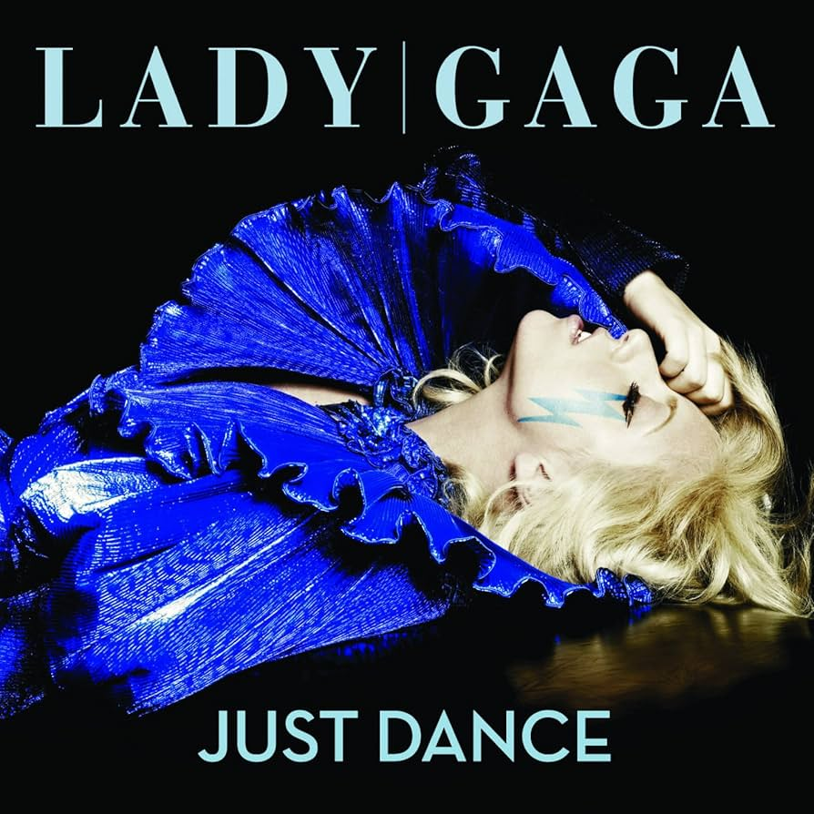
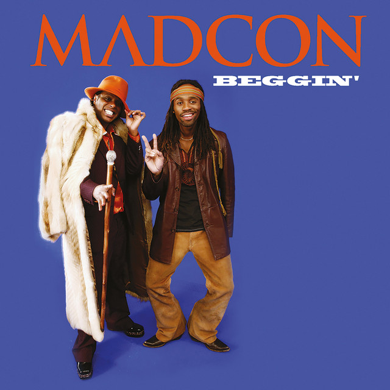
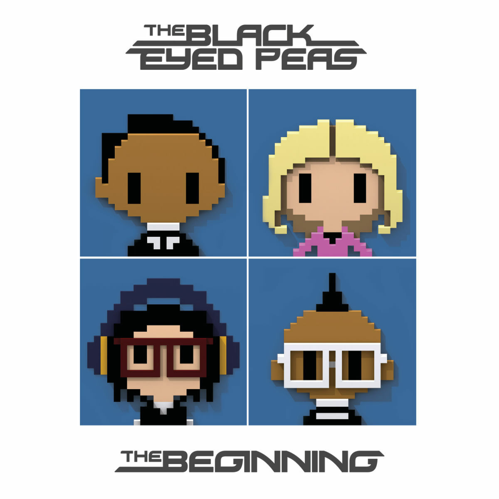
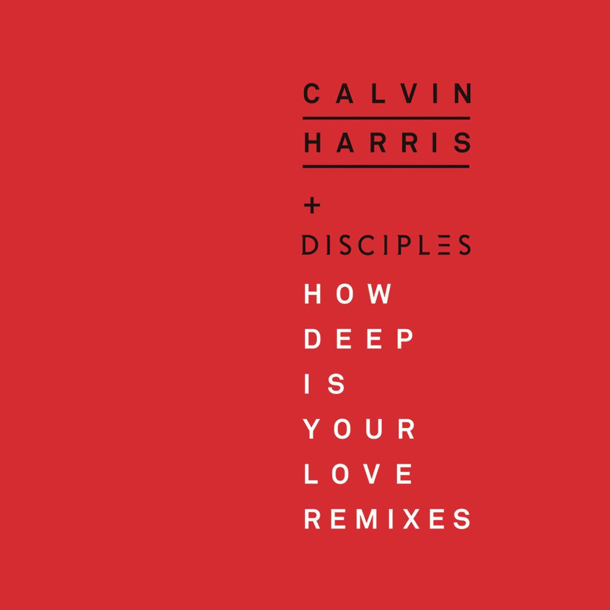

[Accueil](index.md) | [Chill](chill.md) | [Dynamique](dynamique.md) | [Festif](festive.md)

 

# Festive 🎉

 

>La vibe festive, c’est celle qui te met direct dans l’ambiance, qui te donne envie de te lever, de bouger, ou de lever un verre avec des amis.  
>Ces albums et morceaux ne sont pas seulement là pour faire du bruit : ils créent une atmosphère, un moment à partager, qu’on soit seul ou à plusieurs. On ressent l’énergie, l’euphorie, mais aussi la chaleur humaine qui accompagne chaque note.  

>Pas besoin d’être en soirée pour en profiter — ça peut être en cuisine à préparer un dîner, dans ta chambre à te laisser emporter, ou en voiture sur la route. L’important, c’est que la musique te donne envie de sourire, de chanter ou de danser, sans réfléchir.  
>Ces albums ont tous cette capacité à capter l’instant et à le rendre mémorable, avec des sons qui s’impriment et une énergie qui reste longtemps après l’écoute.

 

## S&M - Rihanna

 

 

Avec *S&M*, Rihanna livre un titre qui ne laisse personne indifférent. L’énergie est brute, assumée, et pensée pour être vécue fort, de préférence à volume maximum. En soirée, c’est typiquement le genre de morceau qui ne peut pas rester en arrière-plan : il attire tout de suite l’attention et transforme l’atmosphère. On chante, on danse, on joue le jeu. Plus qu’un simple morceau pop, c’est un déclencheur qui marque un moment précis, celui où la soirée bascule dans quelque chose de plus intense.

[Écouter sur Spotify ➡️](https://open.spotify.com/intl-fr/track/0C4ejWmOTMv8vuYj85mf8m)

 

---

 

## Just Dance - Lady Gaga

 

 

Dès les premières notes, Just Dance impose une évidence : danser. Sorti à une époque où Lady Gaga commençait à redéfinir la pop, ce morceau a gardé une puissance intacte. En soirée, il a un effet fédérateur immédiat. Même quand l’ambiance retombe, il suffit de l’entendre pour que les gens se lèvent, retrouvent le sourire, et repartent. Ce n’est pas seulement une chanson entraînante, c’est une invitation à lâcher prise, à oublier le reste pour profiter de l’instant.

[Écouter sur Spotify ➡️](https://open.spotify.com/intl-fr/track/1dzQoRqT5ucxXVaAhTcT0J)

 

---

 

## Beggin - Madcon

 

 

Avec son mélange de soul vintage et d’énergie pop moderne, Beggin est un titre qui a su traverser le temps. Tout le monde connaît son refrain, et c’est précisément ce qui en fait un classique des moments collectifs. Il ne demande rien de plus qu’un groupe de personnes prêtes à chanter ensemble, sans réfléchir. Sa force est de rester simple, immédiat, festif, mais toujours efficace.

[Écouter sur Spotify ➡️](https://open.spotify.com/intl-fr/track/1XyL3J7eTTKnxRZAM3LqIT)

 

---

 

## Just Can't Get Enough - Black Eyed Peas

 

 

Ici, c’est la carte nostalgie. Les Black Eyed Peas ont marqué toute une génération, et ce titre en particulier incarne leur côté lumineux et fédérateur. Dès que le refrain démarre, il provoque un élan collectif : on chante ensemble, presque automatiquement, avec cette impression de revenir quelques années en arrière. C’est un morceau qui ne se contente pas d’accompagner la fête : il crée un moment de partage simple, chaleureux et mémorable.

[Écouter sur Spotify ➡️](https://open.spotify.com/intl-fr/track/3JA9Jsuxr4xgHXEawAdCp4)

 

---

 

## How Deep Is Your Love - Calvin Harris ft. Disciples

 

 

Ce morceau change un peu de registre, mais garde une place essentielle dans une ambiance festive. Plus hypnotique et sensuel que les autres, il apporte un contraste intéressant dans une playlist. Les basses profondes, le rythme entraînant et les voix planantes en font un titre parfait pour passer d’une énergie légère et conviviale à quelque chose de plus immersif. C’est une montée en intensité qui garde la fête vivante, tout en la rendant plus profonde.

[Écouter sur Spotify ➡️](https://open.spotify.com/intl-fr/track/22mek4IiqubGD9ctzxc69s)

 

[⬅ Retour à l’accueil](index.md)
